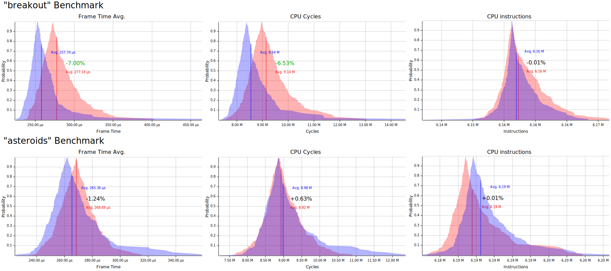

# Bevy Benchmark Games

These are "games" that require no user imput and that can be run headless for use as benchmarks for the Bevy ECS and core systems. The goal is to create something that has the overall "shape" of a game to help invoke performance characteristics more close to a real game.

The only current example is an asteroids-like game that looks like this when run with graphics:

## Usage

> **Note:** These benchmarks only run on Linux because of a depencency on the Linux `perf` module. If you want to run these on Windows it would not be hard to compile out the pieces that won't work on Windows I just haven't spent the time to do it yet. Let me know if this is a blocker for you.

To run the benchmark simply `cargo run --release` and it will run each game for a batch of frames, and record the following for each iteration:

- The average frame time
- The number of CPU cycles spent
- The number of CPU instructions run

The results will be recorded in a report at `target/report.svg`.

### Reading the Graphs

The blue section of the graphs represent the latest run and the red section of the graphs represent the previous run.

The Y axis in the graphs represents the probability that the given measurement will fall into that range and the vertical line represents the average value.

## Headful Mode

There's a half-baked feature where you can run `cargo run -- --no-headless` and it will actually display the graphical version of the game as it runs, and it will run far fewer iterations ( because they are so much slower with graphics running ). This is really just for making sure the logic remotely works and isn't supposed to be useful for benchmarking.
